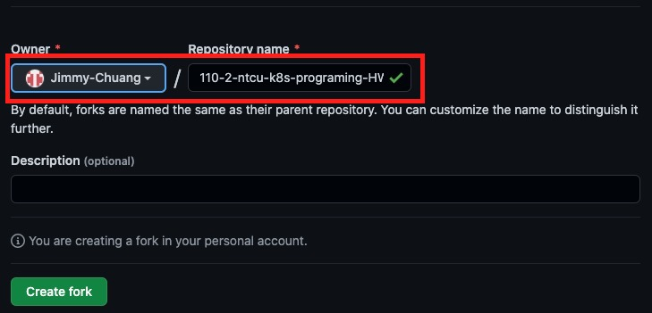
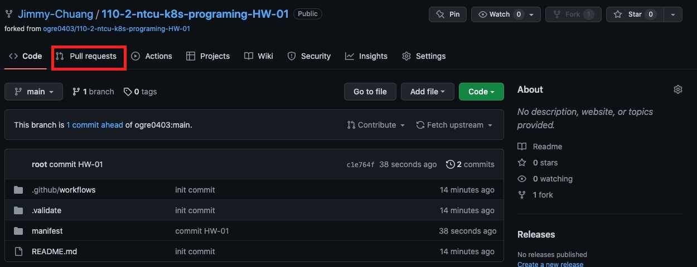
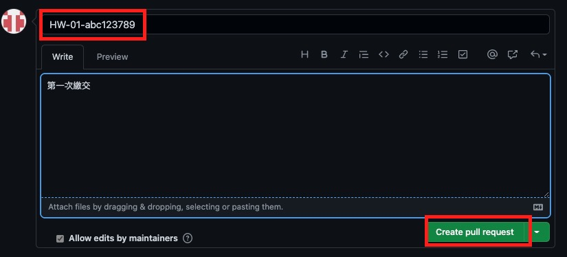
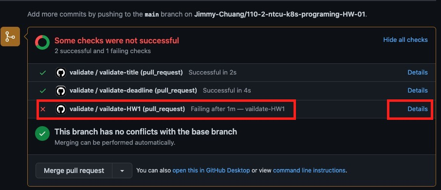
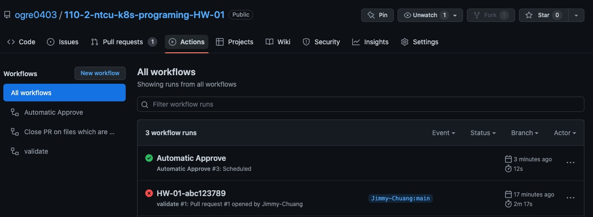
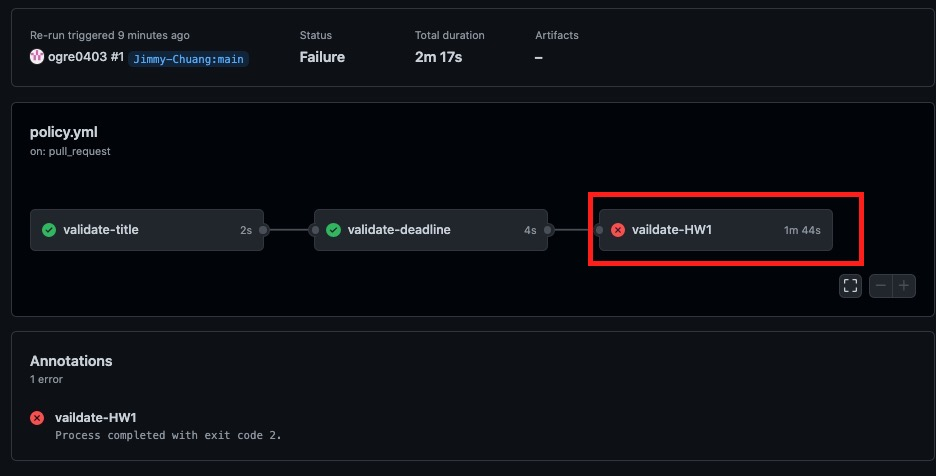
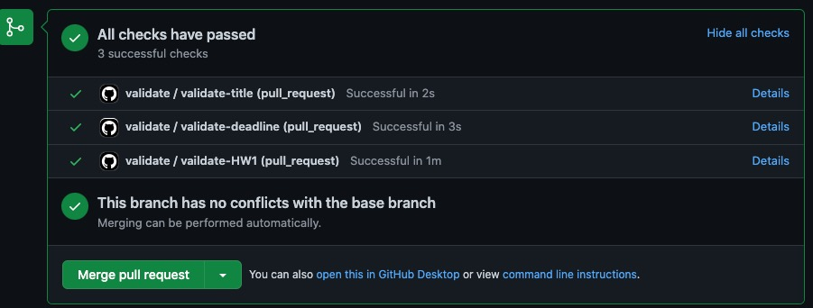

#  HW-01 上傳指引

## 作業要求
1. 撰寫相關的YAML檔案，用來建立Deployment與Service。
2. 建立Deployment，image使用web service類型的image,例如nginx
3. 建立Service，類型使用NodePort
4. 從本地利用curl透過NodePort存取Deployment的web service

## 繳交作業流程
1. fork [upstream HW-01 專案](https://github.com/ogre0403/110-2-ntcu-k8s-programing-HW-01) 至自己的Github帳號的downstream HW-01專案。
   
   
   
2. 依作業要求撰寫相關程式碼後，commit/push至自己Github帳號的downstream HW-01專案。
3. 向upstream HW-01 專案的 `main` 分支發起pull request。
   
   
   
   
4. 建立PR時，請注意下列要求。**若不符合，會導致Github自動測試失敗，而無法完成繳交。**
   * 建立manifest目錄，將YAML檔至於manifest目錄內
   * 建立的PR名稱 必為 `HW-01-[a-z]{3}[0-9]{6}`
   * 嚴禁修改 `.validate/*`以及 `.github/workflows` 的內容。若有修改，會導致無法建立PR
   * 本次作業deadline為 `2022/06/13 00:00`
5. 約15~20分鐘後，至 [upstream HW-01 專案 PR頁面](https://github.com/ogre0403/110-2-ntcu-k8s-programing-HW-01/pulls)，檢視是否測試成功。
   
   * 若不成功，依測試結果的錯誤訊息進行修正後再重新push即可，**不用再建立新的PR**. 
   
   
   
   
   * 看到測試成功，即算完成作業繳交
   
    
   * 在deadline前可以無限重新push修正的版本，直到測試成功。

## 若測試不成功該怎麼辦?
1. 請先確認撰寫的程式是否有問題，並依相每次的作業上傳要求進行配置。
2. 自動化測試，仍有可能因未考量周全造成測試失敗。若認為作業已依繳交要求進行繳交，但測試程式仍測試失敗，請再和老師聯絡。